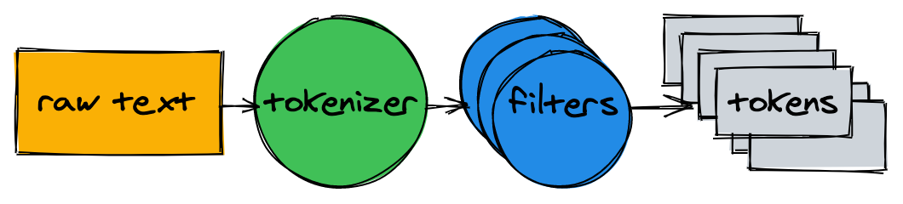

# Build a Full-Text Search engine（全文搜索引擎）
##背景知识
- 全文搜索引擎是我们每天都在用的工具，每当我们点击一次“谷歌搜索” or “百度搜素”，实际上就进行了一次全文搜索（Full-Text Search)。
- 全文搜索（FTS）是一种用于在文档集合中搜索文本的技术。 文档可以指网页，报纸文章，电子邮件或任何结构化文本。
- 本仓库实现了一个简单的全文搜索引擎，用到的语言为Golang，并且用gin做了个简单的接口，被搜索的材料为wiki百科的压缩包，格式为xml。
##运行方式
- [下载wiki的压缩包](dumps.wikimedia.org)，放到full_text_search_engine2这个文件夹下。
- 安装Golang语言环境，配置好环境变量、工作空间。
- 用下面命令安装必要的依赖包
```golang
go get 	"github.com/gin-gonic/gin"
go get  "github.com/kljensen/snowball/english"
```
- 使用curl或者postman等工具向接口127.0.0.1:8080/search这个接口发送POST请求，数据格式为JSON，具体格式如下：
```json
{
  "search_string": "想要搜索的内容，由于被搜索对象为英文，建议输入英文字符串",
}
```
- 返回包含关键词的xml文件序号
##代码流程说明
- 文本分析

这一步做的工作主要是首先将文本转换为token，再堆token做过滤，过滤的手段有转换为小写（使搜索结果大小写不敏感）、丢掉常用词（and、is、or、he she...，放到中文里就是和、是、他、她等，这些词占比庞大，并且对我们的搜索结果没有影响，所以把它们去掉）、同义词转换（单词的大小写、单数复数过滤，这里用的是开源的库解决）。
- 构造索引
这一步将token和对应的文件序号对应起来（倒排索引的关键）。
- 查询
每个token都会查询一次，将结果的交集返回。